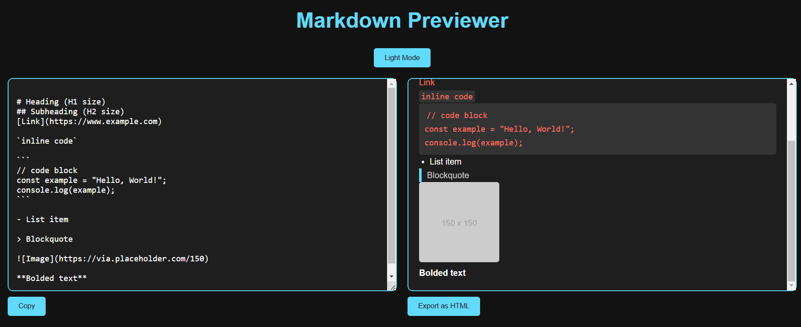

# 🚀 Markdown Previewer

A **simple** and **modern** Markdown Previewer built with **React**. This app allows users to write Markdown in a text editor ✍️ and see the live preview of the rendered **HTML** 🖥️.

---

## ✨ Features

✅ **Live Markdown Preview**: See the rendered HTML in **real-time** as you type.

✅ **GitHub-Flavored Markdown**: Supports GitHub-flavored Markdown syntax 🐙.

✅ **Copy to Clipboard**: Easily copy the Markdown content to the clipboard 📋.

✅ **Dark/Light Mode**: Toggle between dark 🌙 and light ☀️ themes for better usability.

✅ **Markdown Cheatsheet**: A quick reference guide for Markdown syntax 📄.

✅ **Export as HTML**: Export the rendered Markdown as an **HTML file** 📤.

✅ **Responsive Design**: Works seamlessly on **desktop** 🖥️ and **mobile devices** 📱.

---

## 🖥️ Demo

Try the **live demo** here: [[Markdown Previewer Demo]((https://eddieborbon.github.io/markdown-previewer/))](https://eddieborbon.github.io/markdown-previewer/) *(Replace with your actual demo link)* 🚀.

---

## 📸 Screenshots


---

## 🛠️ Technologies Used

- ⚛️ **React**: Frontend framework for building the user interface.
- 📖 **Marked**: A Markdown parser for rendering Markdown to HTML.
- 🛡️ **DOMPurify**: Sanitizes the rendered HTML to prevent XSS attacks.
- 🔲 **React-Split-Pane**: Allows resizing of the editor and preview sections.
- 🎨 **CSS**: Styling for a **modern** and **responsive** design.

---

## 🛠️ Installation

To run this project **locally**, follow these steps:

1. **Clone the repository**:
   ```bash
   git clone https://github.com/yourusername/markdown-previewer.git
   ```

2. **Navigate to the project directory**:
   ```bash
   cd markdown-previewer
   ```

3. **Install dependencies**:
   ```bash
   npm install
   ```

4. **Start the development server**:
   ```bash
   npm start
   ```

5. Open your browser 🌐 and go to [http://localhost:3000](http://localhost:3000) to view the app 🚀.

---

## 🎯 Usage

1. Open the app in your browser 🖥️.
2. Write **Markdown** in the editor section ✍️.
3. The **preview** section will automatically update to show the rendered **HTML**.
4. Use the **"Copy"** button 📋 to copy the Markdown content.
5. Toggle between **dark 🌙** and **light ☀️** modes with the theme switcher.
6. Refer to the **Markdown Cheatsheet** 📄 for syntax help.

---

## 🤝 Contributing

🎉 **Contributions are welcome!** 🎉

Here's how you can contribute:

1. **Fork** the repository 🍴.
2. Create a new branch:
   ```bash
   git checkout -b feature/YourFeature
   ```
3. Make your changes and **commit** them:
   ```bash
   git commit -m 'Add some feature'
   ```
4. Push to the branch:
   ```bash
   git push origin feature/YourFeature
   ```
5. Open a **Pull Request** 🚀.

---

## 📜 License

This project is licensed under the **MIT License** 📝. See the [LICENSE](LICENSE) file for details.

---

## 👨‍💻 Author

👤 **Eddie Jonathan García Borbón**

- **Portfolio**: [Your Portfolio](#) 

---

## 🙌 Acknowledgments

Special thanks to the following tools and libraries:

- **Marked** 📖: A Markdown parser and compiler.
- **DOMPurify** 🛡️: A DOM-only, super-fast, uber-tolerant XSS sanitizer.
- **React** ⚛️: A JavaScript library for building user interfaces.

---

🚀 *Feel free to customize this README to include your personal details, project screenshots, and any additional features you've implemented.* 🌟

🔥 Let me know if you need further assistance! 🚀
